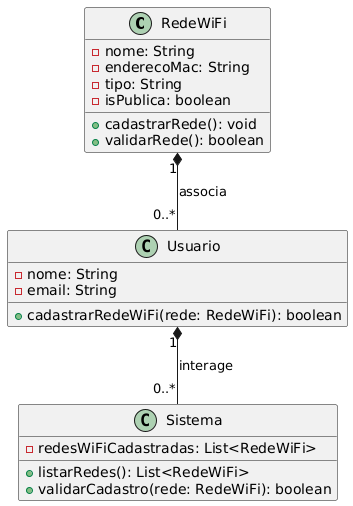

# 🌐 SenhaFácil

## 💡 Motivação:
Facilitar o acesso à internet, permitindo que usuários se conectem a redes Wi-Fi compartilhadas de forma prática e segura, contribuindo na economia de dados móveis e melhorando a experiência digital em qualquer lugar.

## ⚙️ Requisitos Funcionais:

- O sistema deve listar as redes Wi-Fi detectadas pelo dispositivo.
- O sistema deve permitir que o usuário conecte-se a uma rede Wi-Fi, usando as informações armazenadas no Firestore.
- O sistema deve permitir que o usuário cadastre uma rede Wi-Fi no Firestore, informando o nome da rede e sua senha.
- O sistema deve verificar se a rede Wi-Fi selecionada já está cadastrada no Firestore antes de permitir o cadastro.
- O sistema deve permitir que o usuário deslogue da aplicação.
- O sistema deve validar se a conexão foi bem-sucedida.

## 🛠️ Requisitos Não Funcionais:

- A interface deve ser intuitiva e facilitar a navegação do usuário, incluindo mensagens claras de feedback.
- O sistema deve ser capaz de gerenciar um número elevado de redes Wi-Fi cadastradas sem comprometer o desempenho.
- O sistema deve lidar com falhas de conexão Wi-Fi ou Firestore, apresentando mensagens de erro claras e garantindo que o usuário consiga continuar utilizando a aplicação.

## 📝 Metodologia:

- Metodologia Aplicada: Kanban
- Ferramentas: Trello
- Organização:
   - Definindo e dividindo as tarefas em cards e entregas incrementais.
   - Realizando sprints para implementar e testar as funcionalidades desenvolvidas.

## 🖥️ Tecnologias Aplicadas

Linguagens:
- Dart: A linguagem principal utilizada para desenvolver o aplicativo Flutter.

Banco de Dados:
- Firebase Firestore: Utilizado para armazenar dados, como as redes Wi-Fi e suas senhas.

Ferramentas:
- Flutter: Framework para o desenvolvimento de aplicativos móveis.
- Firebase: Plataforma de desenvolvimento de aplicativos móveis e web que oferece uma série de serviços como autenticação, banco de dados em tempo real (Firestore), entre outros.
- WiFiForIoTPlugin: Plugin utilizado para manipulação de redes Wi-Fi no dispositivo móvel. Permite listar redes Wi-Fi disponíveis e conectar-se a elas.
- Git: Utilizado para o versionamento de código, permitindo o controle de alterações.
- Android Studio: IDE oficial para o desenvolvimento de aplicativos Android, com suporte completo para Java, Kotlin, e ferramentas específicas para o desenvolvimento móvel.

Bibliotecas:
- Firebase Auth: Biblioteca para autenticação de usuários via Firebase. O aplicativo permite que o usuário se autentique com email e senha.
- Firebase Core: Biblioteca que inicializa o Firebase no aplicativo.
- Cloud Firestore: Biblioteca que permite interação com o Firestore para ler e gravar dados em tempo real.
- Wifi Iot: Biblioteca para acessar redes Wi-Fi disponíveis no dispositivo e realizar conexões.
- Flutter: A biblioteca principal do framework Flutter, que contém as ferramentas essenciais para o desenvolvimento de interfaces móveis.

## 🖥️ Modelagem

## Classes principais:
- LoginScreen
- InicioTela

### 📱 Classe LoginScreen (Arquivo: `login_screen.dart`)

**Propósito:** Esta classe é a tela de login e cadastro do usuário. Ela permite ao usuário entrar com um e-mail e senha ou se cadastrar no sistema, usando um serviço de autenticação.

**Estrutura:**
- A classe é um `StatefulWidget` que mantém o estado do formulário de login e cadastro.
- Possui controladores de texto (`TextEditingController`) para e-mail, senha e nome (no caso de cadastro).
- O formulário é validado ao pressionar o botão de "Entrar" ou "Cadastrar". Dependendo do valor de `queroEntrar`, o método `botaoPrincipalClicado` chama o serviço de autenticação (`_autoServico.logarUsuario` ou `_autoServico.cadastrarUsuario`).

**Código:**
```dart
class LoginScreen extends StatefulWidget {
  const LoginScreen({super.key});

  @override
  State<LoginScreen> createState() => _LoginScreenState();
}

class _LoginScreenState extends State<LoginScreen> {
  bool queroEntrar = true;
  final _formKey = GlobalKey<FormState>();

  TextEditingController _emailController = TextEditingController();
  TextEditingController _senhaController = TextEditingController();
  TextEditingController _nomeController = TextEditingController();

  AutenticacaoServico _autoServico = AutenticacaoServico();

  @override
  Widget build(BuildContext context) {
    // Estrutura do formulário de login e cadastro
  }

  botaoPrincipalClicado() {
    String nome = _nomeController.text;
    String email = _emailController.text;
    String senha = _senhaController.text;

    if (_formKey.currentState!.validate()) {
      if (queroEntrar) {
        print("Entrada Validada");
        _autoServico.logarUsuario(email: email, senha: senha).then(
          (String? erro) {
            if (erro != null) {
              mostrarSnackBar(context: context, texto: erro);
            }
          },
        );
      } else {
        print("Cadastro Validado");
        _autoServico
            .cadastrarUsuario(nome: nome, senha: senha, email: email)
            .then(
          (String? erro) {
            if (erro != null) {
              // Voltou com erro
              mostrarSnackBar(context: context, texto: erro);
            }
          },
        );
      }
    } else {
      print("Form inválido!");
    }
  }
}
```

### 📱 Classe InicioTela (Arquivo: `menu.dart`)

**Propósito:** A classe `InicioTela` é responsável por exibir redes Wi-Fi disponíveis ao usuário. Ela usa o plugin `WiFiForIoTPlugin` para listar as redes Wi-Fi e permite ao usuário conectar a elas. Se a rede for encontrada na coleção do Firebase Firestore, ela tenta se conectar à rede Wi-Fi. Caso contrário, a tela de cadastro de rede será aberta.

**Estrutura:**
- A tela exibe uma lista de redes Wi-Fi disponíveis e, ao selecionar uma rede, o aplicativo verifica se existe uma senha associada no Firebase Firestore. Dependendo da existência da senha, o aplicativo tenta conectar à rede.
- A classe também contém uma tela de "drawer" (menu lateral) para deslogar o usuário e outras opções.

**Código:**
```dart
class InicioTela extends StatefulWidget {
  const InicioTela({super.key});

  @override
  State<InicioTela> createState() => _InicioTelaState();
}

class _InicioTelaState extends State<InicioTela> {
  List<WifiNetwork> wifiNetworks = [];
  bool isLoading = true;

  @override
  void initState() {
    super.initState();
    fetchWifiNetworks();
  }

  Future<void> fetchWifiNetworks() async {
    // Função para buscar redes Wi-Fi
  }

  Future<void> conectarRede(String ssid, String senha) async {
    // Função para conectar-se a uma rede Wi-Fi
  }

  @override
  Widget build(BuildContext context) {
    // Exibição das redes Wi-Fi
  }
}
```
## 📂 Organização do Repositório  
lib/  
├── main.dart  
├── _comum/  
│   ├── colors.dart  
│   └── snackbar.dart  
├── components/  
│   └── decoration.dart  
├── screens/  
│   ├── cadastrar_rede.dart  
│   ├── login_screen.dart  
│   └── menu.dart  
├── services/  
│   └── autentication.dart  

## 🛠️ Processo de Desenvolvimento

### Uso de TDD (Test-Driven Development):

- Foi criado testes unitários para cada funcionalidade implementada do aplicativo.

```dart
test('Verifica se o Wi-Fi está habilitado', () async {
  // Teste se o método isEnabled() retorna o valor esperado
  final isEnabled = await mockPlugin.isEnabled();
  expect(isEnabled, true); // Ou o valor esperado
});
```

Este código realiza um teste unitário para verificar se o método isEnabled() de um mock de plugin Wi-Fi retorna true, ou seja, se o Wi-Fi está habilitado. Se o valor retornado for diferente de true, o teste falha. O teste usa o framework de testes do Flutter e a função expect para validar o resultado esperado.

```dart
testWidgets('Testa o fluxo de login com falha', (WidgetTester tester) async {
  // Criar um mock do serviço de autenticação
  final mockAutenticacao = MockAutenticacaoServico();

  // Simula o comportamento do login com falha
  when(mockAutenticacao.logarUsuario(
    email: "test@example.com", senha: "senhaErrada"))
  .thenAnswer((_) async => "Credenciais inválidas");

  // Carregar a tela de login
  await tester.pumpWidget(MaterialApp(
    home: LoginScreen(),
  ));
});
```
Este código testa o fluxo de login com falha. Ele cria um mock do serviço de autenticação e simula uma tentativa de login com e-mail e senha errados, retornando uma mensagem de "Credenciais inválidas". Em seguida, carrega a tela de login e prepara o ambiente para testar esse comportamento na interface, verificando se a falha no login é tratada corretamente.

## 📊 Diagrama de Classes


## 📊 Diagrama de Atividades


## 🚀 Trabalhos Futuros
- Melhoria da Experiência do Usuário (UX)​
- As senhas das redes Wi-Fi devem ser armazenadas de forma segura no Firestore, utilizando técnicas de criptografia.​
- Termos de Responsabilidade ao Cadastrar Redes Wi-Fi​
- Integração com Outras Plataformas
